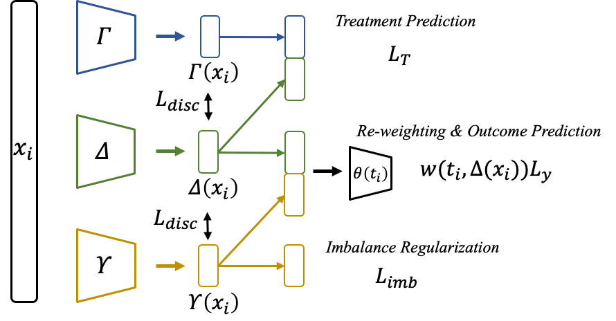
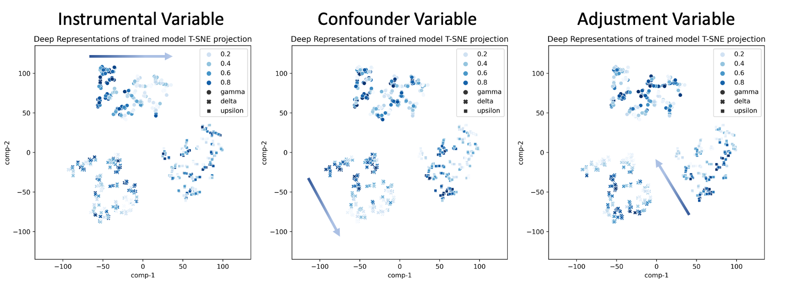

# DTRNet
We investigate the problem of generating appropriate disentangled representations that adjust for the selection bias precisely to estimate the individual treatment effect with continuous treatments. We propose a novel Disentangled Representation Network (DTRNet) for ITE estimation with continuous treatments. DTRNet learns disentangled representations and controls the selection bias precisely. The architecture and some results of our model is as follows:
 

This code is based on VCnet: https://github.com/lushleaf/varying-coefficient-net-with-functional-tr/blob/main/README.md#how-to-run

# How to run

## To run the experiment with simulated data:

-- generate simulated data

python simu1_generate_data.py

-- train and evaluating the methods

python DTRNet_main.py

## To run the experiment with ihdp data:
-- generate ihdp data

python ihdp_generate_data.py

-- train and evaluating the methods

python DTRNet_ihdp.py

## To run the experiment with news data:
-- generate ihdp data

python news_generate_data.py

-- train and evaluating the methods

python DTRNet_news.py

#To plot the disentangle plot 

##Tips:
To control the number of dataset that you want to run, adjust num_dataset in argparse in the file.

